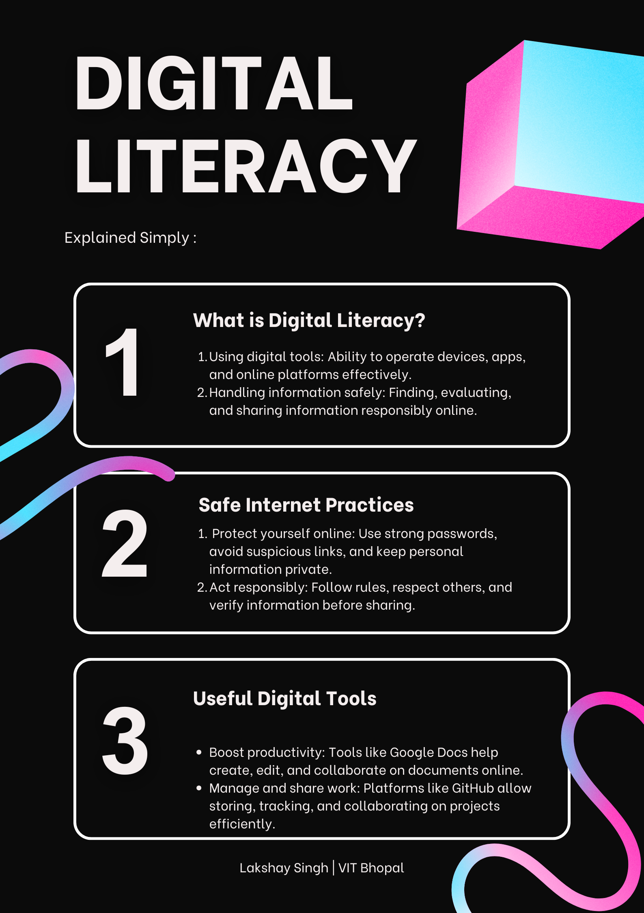

## Task 1 – Digital Literacy Infographic

For Task 1, I created a digital literacy awareness infographic using Canva. 

The design focuses on three key aspects:
- Understanding digital literacy  
- Practicing safe internet habits  
- Using useful digital tools such as Google Docs and GitHub  

One challenge I faced was selecting the right amount of content so that the infographic remained informative but not overcrowded. It was interesting to learn how visual design plays an important role in communication and how digital tools can be used creatively to present information in an engaging way.

---

## 🖼️ Infographic Preview

