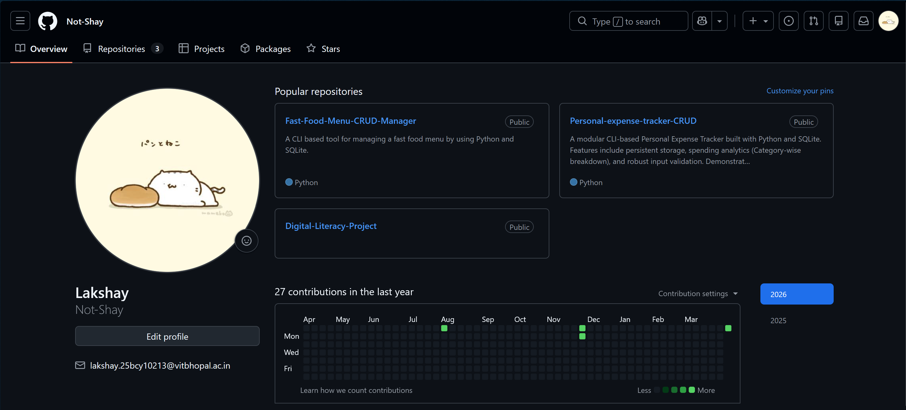
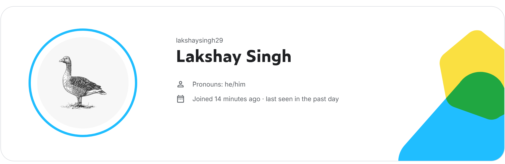

## Task 2 – Digital Portfolio

For this task, I created professional profiles on GitHub, LinkedIn, and Kaggle.

- GitHub is used to store and manage code repositories and projects.
- LinkedIn is a professional networking platform used to connect with industry professionals and showcase educational background.
- Kaggle is a platform for learning data science, participating in competitions, and working with datasets.

Over the next four years, I plan to use GitHub to build and showcase projects, LinkedIn to connect with professionals and explore opportunities, and Kaggle to improve my data analysis and problem-solving skills.

## 📸 Profile Screenshots

### GitHub

### LinkedIn

### Kaggle

