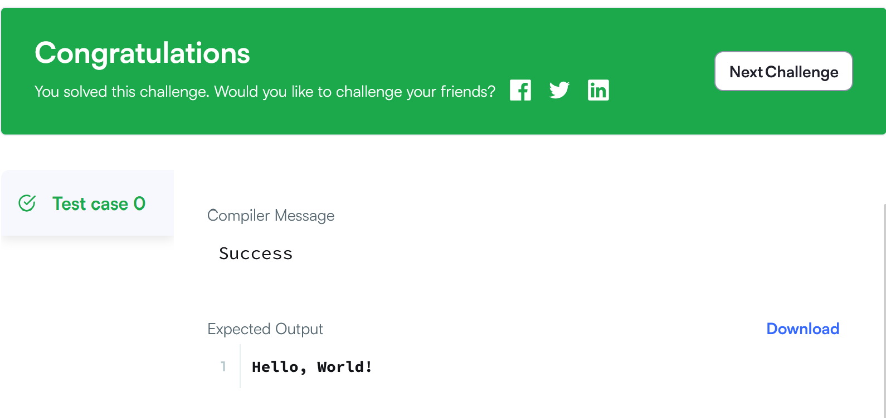
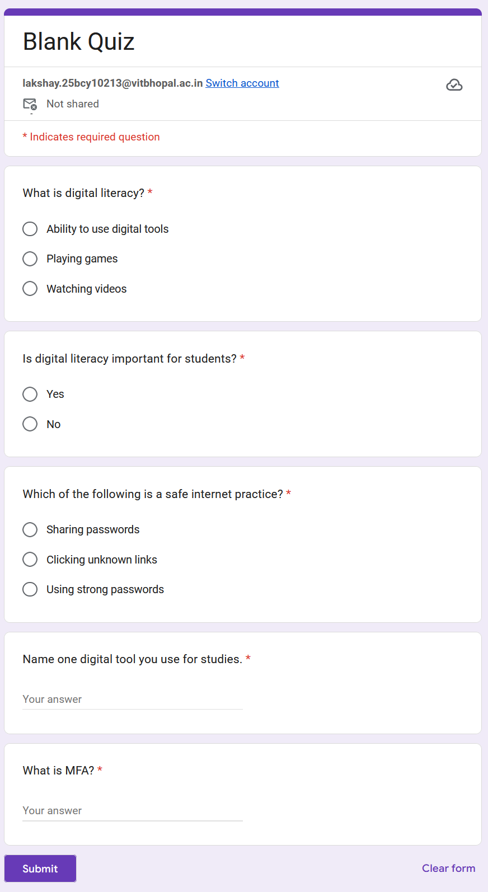
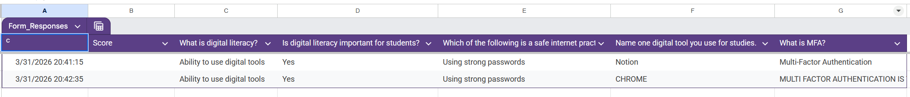

## Task 3 – Platforms

For this task, I explored coding and collaboration platforms.

I used HackerRank to practice coding and successfully completed a beginner-level problem. This helped me understand basic problem-solving and programming concepts.

I also created a Google Form titled "Digital Literacy Awareness Quiz" with five questions. The form includes multiple choice and short answer questions. I linked the form responses to Google Sheets to analyze the data.

These tools will help me improve my coding skills and collaborate effectively in academic projects.

Google Forrm: https://docs.google.com/forms/d/e/1FAIpQLSfG01IbAM-eHBk9cbgXN7t7RR_xN3aPpaNCqhLj1dD_1EisuA/viewform?usp=publish-editor

## Task 3 Screenshots

### HackerRank

### Google Form

### Google Sheet

